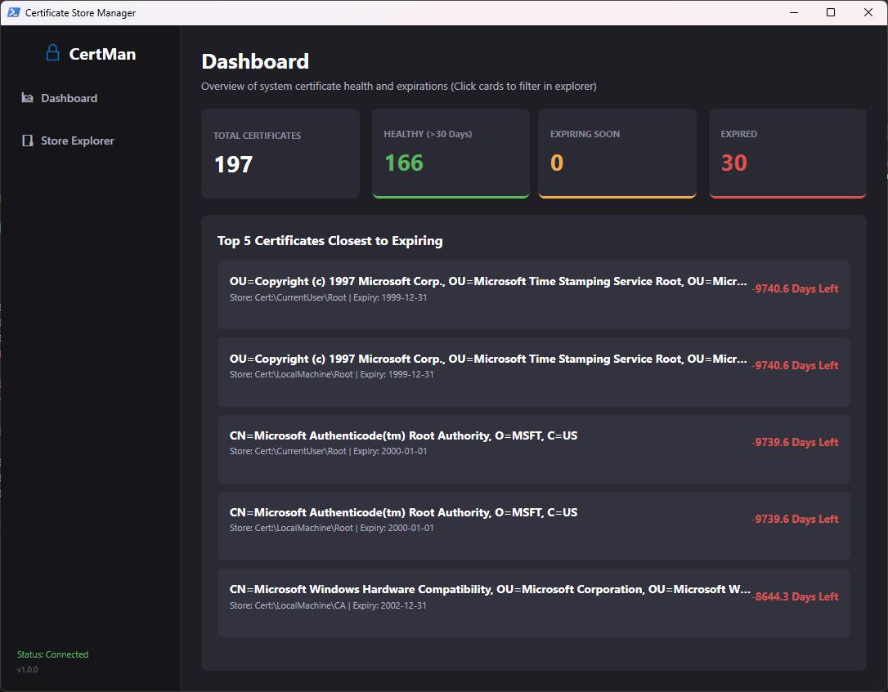

# CertMan - Certificate Store Manager

**CertMan** is a modern, desktop GUI application written in Windows PowerShell and WPF (Windows Presentation Foundation). It provides a clean, dark-themed dashboard and interactive explorer for viewing, monitoring, inspecting, importing, exporting, and deleting certificates across Windows Certificate Stores (`CurrentUser` and `LocalMachine`).




---

## 🌟 Key Features

* **Interactive Health Dashboard**:
  * **Summary Cards**: At-a-glance count of **Total**, **Healthy** (>30 days remaining), **Expiring Soon** (≤30 days remaining), and **Expired** certificates.
  * **Click-to-Filter**: Click any dashboard summary card to jump straight to the Store Explorer pre-filtered by that status.
  * **Top 5 Nearest Expiration List**: Visual progress indicators highlighting certificates closest to their expiration date.

* **Certificate Store Explorer**:
  * **Store Navigation**: Tree view support for navigating `CurrentUser` and `LocalMachine` stores (e.g., Personal, Trusted Root Certification Authorities, Intermediate Certification Authorities, WebHosting).
  * **Search & Filter**: Real-time search by Subject name, Issuer, or status keywords (`status:expired`, `status:soon`, `status:healthy`).

* **Certificate Actions**:
  * **View Details**: Inspect full certificate parameters including Subject, Issuer, Serial Number, Thumbprint, Validity Range, Signature Algorithm, and Key Length.
  * **Import**: Import certificates (`.cer`, `.crt`, `.pfx`) into any store, with built-in password prompt support for PFX private key containers.
  * **Export**: Export selected certificates to file format (`.cer` DER binary, `.crt` Base64 ASCII, or `.pfx` with optional password protection).
  * **Delete**: Safely delete certificates from stores with built-in confirmation dialogs.

---

## 📋 Prerequisites

* **Operating System**: Windows 10, 11, or Windows Server 2016+
* **PowerShell**: Windows PowerShell 5.1 or PowerShell 7 (Desktop edition with WPF support enabled)
* **Permissions**:
  * Managing **Current User** stores (`Cert:\CurrentUser\`) requires standard user permissions.
  * Managing **Local Machine** stores (`Cert:\LocalMachine\`) requires running PowerShell as **Administrator**.

---

## 🚀 Getting Started

1. **Clone or Download** the repository to your local machine.
2. Open **PowerShell** (Run as Administrator if managing Local Machine stores).
3. Navigate to the script directory:
   ```powershell
   cd "C:\path\to\CertMan"
   ```
4. Run the application:
   ```powershell
   powershell -ExecutionPolicy Bypass -File .\CertMan.ps1
   ```
   *Or from within an active PowerShell session:*
   ```powershell
   Set-ExecutionPolicy -Scope Process -ExecutionPolicy Bypass
   .\CertMan.ps1
   ```

---

## 💡 How It Works

### Dashboard
When launched, CertMan scans local certificate stores and categorizes all certificates based on their `NotAfter` expiration dates:
* 🟢 **Healthy**: More than 30 days remaining until expiration.
* 🟡 **Expiring Soon**: 30 days or fewer remaining until expiration.
* 🔴 **Expired**: Past the `NotAfter` date.

### Certificate Management Workflow
1. **Browse**: Click **Store Explorer** in the sidebar and select a store folder from the tree (e.g., `LocalMachine` → `My`).
2. **Search**: Type in the search box to filter by certificate name or issuer.
3. **Inspect**: Select a certificate row in the grid and click **View Details** to display detailed technical properties.
4. **Import / Export / Delete**: Use the action buttons at the bottom of the Store Explorer pane to perform certificate management tasks.

---

## 📄 License

This project is open-source and available under the standard MIT License.
